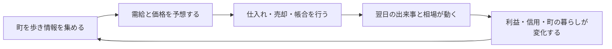

# ゲーム企画書

## 1. 基本情報

| 項目 | 内容 |
|---|---|
| 仮題 | 天下の台所 |
| ジャンル | 米相場生活シミュレーションRPG |
| 舞台 | 江戸時代を下敷きにした架空の大坂 |
| 想定プレイ人数 | 1人 |
| 想定プラットフォーム | PC、将来的に家庭用ゲーム機 |
| 1プレイ | 本編12～20時間、試作は約15分 |
| 中心感情 | 「自分だけが相場の兆しに気づいた」高揚と、その利益が誰かの暮らしを揺らす葛藤 |

## 2. ハイコンセプト

> 米俵の向こうに、人の暮らしが見える相場ゲーム。

亡き親方から小さな米問屋を継いだ主人公が、産地、天候、物流、人の噂を読み、
現物と帳合米を取引する。単に資産を増やすのではなく、商家の信用、奉公人の生活、
町の米価を同時に背負う。

専門知識を先に暗記させず、具体的な出来事から仕組みを発見させる。

- 雨が続く
- 川が増水して船が遅れる
- 市場への入荷が減る
- 売り注文が薄くなる
- 米価が上がる

この因果を、人物、風景、品物、注文板の変化として一続きに見せる。

## 3. 独自の魅力

### 3.1 相場の材料が、町で暮らす人物

情報はニュース一覧ではなく人物から得る。人物には専門、情報精度、利害、主人公への
好感度があり、同じ事実にも異なる解釈を加える。

### 3.2 利益が世界に反映される

米価が上がれば在庫を持つ主人公は儲かるが、長屋の食事は貧しくなる。
安値で放出すれば町は助かるが、店の資金繰りは苦しくなる。

### 3.3 価格形成を本格的に扱う

本編では以下を段階的に解放する。

- 産地・品質・保管状態が異なる現物米
- 売り注文と買い注文による板
- 流動性、値幅、出来高
- 米切手、受渡し、帳合米
- 限月、証拠金、追証
- 現物と先物の裁定
- 蔵、輸送、保険、信用
- 市場介入、買い占め、風説

帳合米は単なる「現代の先物取引の江戸版」として扱わない。現物や米切手の供給を
待たずに取引を続けたい需要から生まれ、投機の厚みが価格発見や流動性を生むという
堂島固有の成立過程を、ゲームの解放順と物語へ反映する。

## 4. プレイヤー体験の柱

### 読む

天候、会話、入荷量、値動きから、まだ価格に織り込まれていない兆しを探す。

### 張る

限られた資金と信用をどこへ投じるか決める。正解ではなく、損失に耐えられる計画を作る。

### 背負う

取引結果が店員、取引先、町の人々へ波及する。儲け方が主人公の評判と物語を作る。

### 育てる

店、蔵、情報網、人材を育て、より遠い産地や複雑な取引へ進む。

## 5. コアループ

1日の中で使える時間には限りがある。多く調べれば判断精度は上がるが、好条件の取引を
逃す可能性がある。

## 6. 長期ループ

1. 一日の相場を乗り切る
2. 一節気の決算を迎える
3. 店と情報網へ投資する
4. 新しい産地・商品・取引制度を解放する
5. 季節ごとの危機と人間ドラマを解決する
6. 一年の商いと町の行く末を確定する

## 7. 主な登場人物案

| 人物 | 役割 | 情報の特徴 |
|---|---|---|
| お糸 | 主人公の店を切り盛りする番頭 | 数字に強く、確実な店内情報を持つ |
| 源次 | 堂島へ通う船頭 | 入荷と川の情報が速いが、相場解釈は大ざっぱ |
| 菊乃 | 諸国を渡る薬種商 | 遠国の兆しを早く掴むが、対価を求める |
| 弥吉 | 瓦版屋 | 世間の空気に詳しいが、面白さのため話を盛る |
| 玄庵 | 元・米会所役人 | 制度と過去の相場に詳しい。主人公の指南役 |
| 千代 | 長屋で飯屋を営む幼なじみ | 米価が庶民の暮らしへ与える影響を伝える |

## 8. 物語の骨格

親方の死とともに発覚した借財を返すため、主人公は30日後の大決済までに店を立て直す。
一方、市場では何者かが米を静かに買い集めている。儲けを追えばその企みに乗れるが、
町の米価は高騰する。

終盤では、プレイヤーが築いた資産、信用、人間関係によって選択肢が変わる。

- 巨利を得て大商人になる
- 相場を安定させ、町に根づく商家になる
- 黒幕を出し抜き、会所の改革者になる
- 破産するが、次代へ知識と縁を残す

## 9. 難易度設計

最初から専門用語を並べず、「出来事→価格→用語」の順に教える。

- 初心者: 仲間が因果関係を言葉で補助する
- 標準: 情報の確度を自分で判断する
- 相場師: 補助を減らし、板と帳簿を中心に判断する

損失は学習機会として扱い、直後に「何が起きたか」を振り返れる相場日誌を用意する。

## 10. アート・音響方針

- 木版画と商家の帳簿を組み合わせた画面
- 数字だけでなく、米俵の山、船着場の混雑、食卓の品数で状態を示す
- 平常時は三味線や町の環境音、急変時は市場のざわめきと拍子木で緊張を作る
- 重要な値動きには、短いアニメーションと人物の反応を添える

## 11. 成功判定

試作テストで次を満たしたら、本制作へ進む。

- 初見プレイヤーの70%以上が、3日以内に値動きの理由を一つ説明できる
- 15分のプレイで、情報収集と売買を3サイクル以上行う
- 「儲かるが町に悪い」選択で迷ったと回答する人が半数を超える
- 再挑戦意向が60%以上ある
